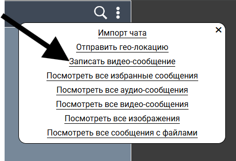

# Проект Chaos Organizer

## В чате сохраняются текстовые сообщения в том числе ссылки

- Ссылки отображаются как ссылки и функционируют как ссылки

## В историю чата можно загрузить аудио, видео, изображение, либо любой другой файл

- Загрузить можно как Drag & Drop
- Так же по нажатию на значок файла

## По можно скачивать фалы на компьютер пользователя

- По нажатию на сообщение с файлом

- Скачать видео

  

* Скачать аудио

## Ленивая подгрузка: сначала подгружаются последние 10 сообщений, при прокрутке вверх подгружаются следующие 10

## Поиск по сообщениям

Что-бы искать по сообщениям нужно нажать на лупу сверху
Далее появиться поле ввода нужного сообщения
По мере набора будут появляться сообщения начинающиеся на то что вводится

## Запись аудио и видео сообщений

Что-бы записать голосовое сообщение нужно нажать на микрофон снизу

Далее вас попросят предоставить доступ к микрофону

Далее начнётся запись голосового сообщения вместо иконки микрофона появится иконке для отправки и стопа, а так же таймер

По завершению аудио сообщение сохранится в истории и его можно будет прослушать

### Запись видео сообщений

Запись видео сообщений аналогична аудио только что-бы её активировать
Нужно сначала нажать на три точки сверху затем нажать на кнопку отправить видео сообщение

далее все аналогично аудио сообщению

## Отправка геолокации

Что-бы отправить геолокацию нужно нажать на три точки сверху, затем на кнопку отправить геолокацию

по завершению в чат выведется геолокация

## Воспроизведение видео и аудио

Воспроизведение видео и аудио производится привычным для пользователя методом

## Закрепление сообщения

Для того что бы закрепить сообщение нужно нажать на красную иконку в углу сообщения

Далее сообщение отобразится сверху и сохраниться там

Что бы его открепить нужно нажать на крестик возле закреплённого сообщения

- Если закрепить другое сообщение старое автоматически открепится

## Добавление сообщение в избранное и просмотр всех избранных сообщений

Что бы добавить сообщение в избранное нужно нажать на звездочку рядом с сообщением

Далее звездочка должна загореться это значит что сообщение добавилось

Для того что бы просмотреть список все избранных сообщений нужно нажать на три точки сверху экрана

Затем на кнопку посмотреть все избранные сообщения

## Просмотр вложений (аудио, видео, изображения и файлы)

Для того что бы просмотреть список все избранных сообщений нужно нажать на три точки сверху экрана

Затем нажать на интересующую кнопку(аудио, видео, изображения и файлы)

## Работа в оффлайн режиме

При потере интернета кэшируется вся страница (иконки, стили и т.д.)
А так же кэшируется загруженные сообщения

## Экспорт и импорт чата

При первом запуске страницы появляется модальное окно с уникальным идентификатором(экспорт)

Для импорта нужно нажать сверху на три точки далее выбрать импорт чата

В появившемся окне вписать уникальный идентификатор если такой чат существует то он импортируется

В противном случае появится модальное окно с надписью "Чата не найдено"

## Поддержка смайликов

Для того что бы открыть меню смайликов нужно нажать на кнопку рядом с микрофоном

Далее появится меню со смайликами если нажать на смайлик то он добавится в поле ввода сообщения

---

**На этом все**
